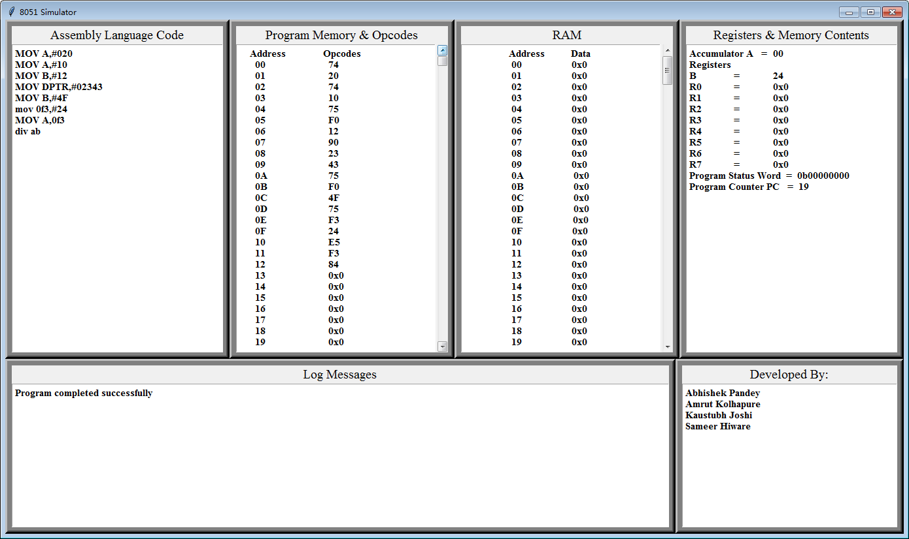

Code is exported from [8051-simluator-using-python - A very basic 8051 simulator using python from google code](https://code.google.com/archive/p/8051-simluator-using-python/)

# A very basic 8051 simulator using python

Our goal is to create a python based 8051 simulator, which can provide the users a platform to test their 8051 codes prior to hardware implementation. It will provide the users ability to debug their codes in a very similar 8051 hardware scenario and help them to modify their codes at an early stage of project development.

# asmwarrior's improvement
I adjust/update the code to Python3 by using the `2to3.py` tool.

To run the code, just type:

~~~~
python main.py test.asm
~~~~
`test.asm` is the input assmbly source code.
And here is the log message from the command line.

~~~~
MOV A,#020
MOV A,#10
MOV B,#12
MOV DPTR,#02343
MOV B,#4F
MOV 0F3,#24
MOV A,0F3
DIV AB
['MOV A,#020', 'MOV A,#10', 'MOV B,#12', 'MOV DPTR,#02343', 'MOV B,#4F', 'MOV 0F3,#24', 'MOV A,0F3', 'DIV AB']
{}
['74', '20', '74', '10', '75', 'F0', '12', '90', '23', '43', '75', 'F0', '4F', '75', 'F3', '24', 'E5', 'F3', '84']
['74', '20', '74', '10', '75', 'F0', '12', '90', '23', '43', '75', 'F0', '4F', '75', 'F3', '24', 'E5', 'F3', '84', '0x0']
19
Program completed successfully
~~~~

And the tkinter window is shown like below:

